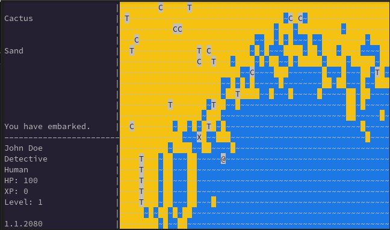

# DIMENSIONER

## Summary

Open world game, world generator and client-server infrastructure

## Technical details

World generator and server are located in the server directory.
Client is located in client-sdl2 and client-godot4. In the latter, use of adapter is mandatory to fulfill transfer to Rust backend to Godot frontend.
